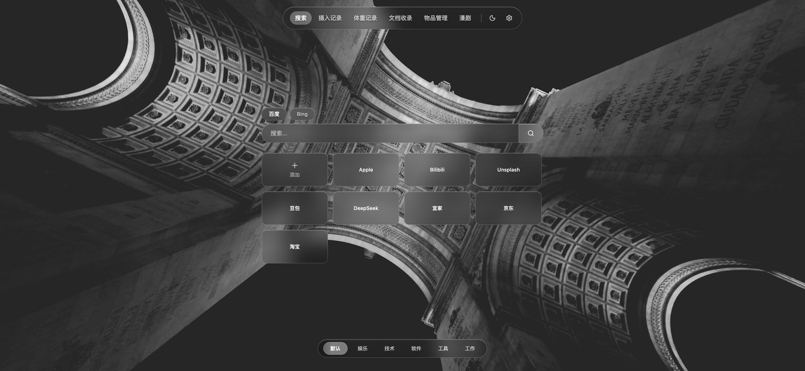
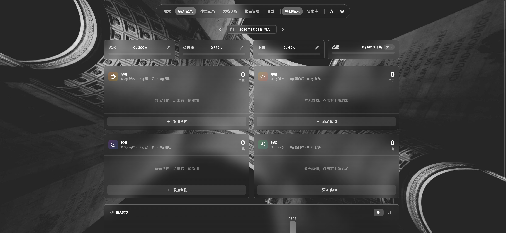
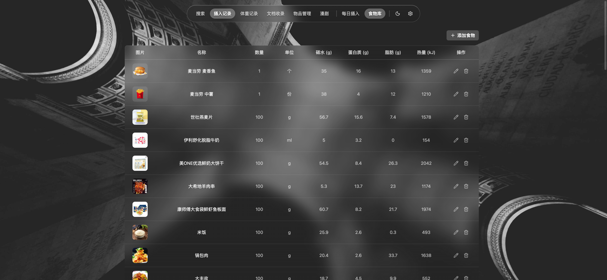
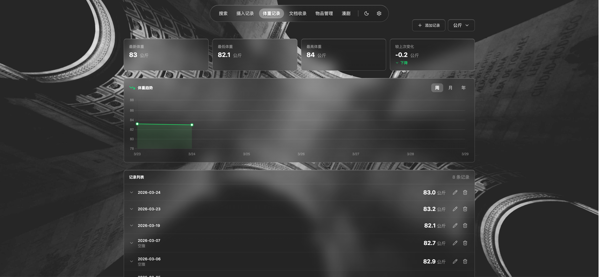
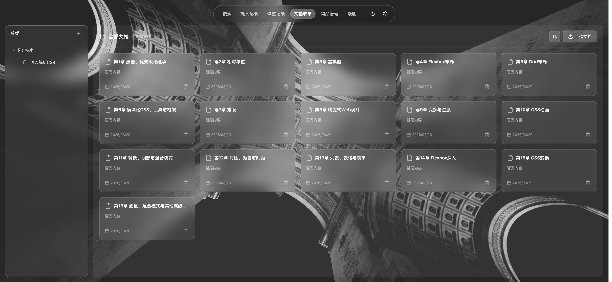
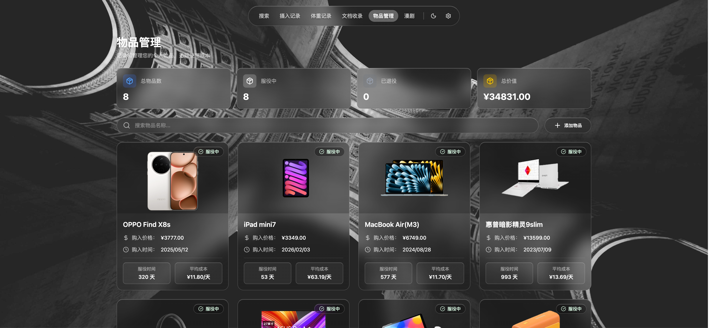
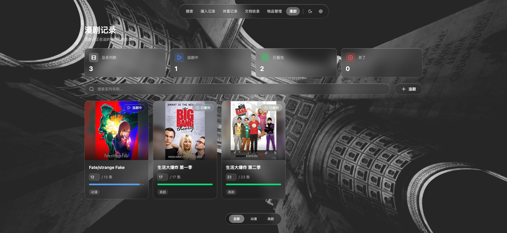

# VisiFind (寻迹)


---

## 项目概述 / Project Overview

VisiFind（寻迹）是一款 Chrome 浏览器扩展，旨在为新标签页提供美观的搜索界面和实用的信息管理工具。除搜索和壁纸功能外，还提供健康数据追踪（饮食摄入、体重记录）、文档管理、物品管理和系列管理等功能。

VisiFind (寻迹) is a Chrome browser extension that provides a beautiful search interface and practical information management tools for your new tab page. Beyond search and wallpaper features, it also offers health data tracking (food intake, weight logging), document management, item management, and series management.

---

## 核心功能 / Features

### 首页 / Home — `/`

首页作为新标签页的主界面，提供搜索框、多引擎切换、Bing 每日壁纸背景以及书签展示功能。用户可快速发起搜索，并直接访问常用网站。

Home serves as the main interface for the new tab page, providing a search box, search engine switching, Bing daily wallpaper background, and bookmark display. Users can quickly initiate searches and access frequently visited sites directly.

### 每日摄入 / Daily Intake — `/intake/daily`

记录每日饮食摄入，追踪热量和营养素摄入情况，支持按餐次（早餐、午餐、晚餐、加餐）分类查看。

Log daily food intake, track calories and nutrient consumption, view by meal type (breakfast, lunch, dinner, snacks).



### 食物库 / Food Library — `/intake/food-library`

管理食物数据库，包含常见食物的营养成分信息，方便在记录摄入时快速选择。

Manage a food database with nutritional information for common foods, enabling quick selection when logging intake.



### 体重记录 / Weight Tracking — `/weight`

记录体重数据，支持查看体重变化趋势图表，帮助追踪健康目标。

Log weight entries and view weight change trend charts to help track health goals.



### 文档管理 / Documents — `/documents`

管理和阅读文档，支持文档列表和树形目录结构，提供阅读界面。

Manage and read documents with a list view and tree directory structure, providing a reading interface.



### 物品管理 / Items — `/items`

管理个人物品，记录物品信息和状态。

Manage personal items, tracking item information and status.



### 系列管理 / Series — `/series`

管理系列内容，适合追踪连续剧、漫画、书籍等系列作品的阅读或观看进度。

Manage series content, ideal for tracking reading or viewing progress of TV shows, comics, books, and other serial works.



---

## 技术栈 / Tech Stack

- **框架 / Framework：** Vue 3 (Composition API + `<script setup>`)
- **构建工具 / Build Tool：** Vite 7
- **状态管理 / State Management：** Pinia
- **路由 / Router：** Vue Router (Hash 模式 / Hash mode)
- **样式 / Styling：** Tailwind CSS 4 + 自定义毛玻璃效果 / Custom frosted glass effects
- **图标 / Icons：** lucide-vue-next
- **数据存储 / Data Storage：** IndexedDB

---

## 安装与加载 / Installation & Loading

### 开发模式 / Development

```bash
npm install
npm run dev
```

<!-- 截图：开发模式预览效果 -->

### 构建 Chrome 扩展 / Build Chrome Extension

```bash
npm run build:extension
```

### 加载扩展 / Load Extension

1. 运行 `npm run build:extension`
2. 打开 Chrome，访问 `chrome://extensions/`
3. 开启「开发者模式」
4. 点击「加载已解压的扩展程序」，选择 `dist` 目录
5. 打开新标签页即可看到扩展界面

1. Run `npm run build:extension`
2. Open Chrome, go to `chrome://extensions/`
3. Enable **Developer mode**
4. Click **Load unpacked** and select the `dist` directory
5. Open a new tab to see the extension interface

<!-- 截图：chrome://extensions 加载步骤 -->

---

## 项目结构 / Project Structure

```
src/
├── main.js                    # index.html 入口 (开发预览用) / Dev preview entry
├── style.css                  # 全局样式 / Global styles
├── App.vue                    # 根组件 / Root component
├── components/                # 共享组件 / Shared components
├── lib/                       # 工具库 / Utilities
└── newtab/                    # 新标签页应用核心 / New tab app core
    ├── main.ts                # 入口文件 / Entry point
    ├── App.vue                # 根组件 (RouterView) / Root component
    ├── router/
    │   └── index.js           # 路由配置 / Router config
    ├── views/                 # 页面视图 / Page views
    │   ├── HomeView.vue       # 首页 / Home
    │   ├── DailyIntake.vue    # 每日摄入 / Daily Intake
    │   ├── FoodLibrary.vue    # 食物库 / Food Library
    │   ├── WeightView.vue      # 体重记录 / Weight Tracking
    │   ├── DocumentsView.vue  # 文档管理 / Documents
    │   ├── ItemsView.vue      # 物品管理 / Items
    │   └── SeriesView.vue     # 系列管理 / Series
    ├── components/            # 组件 / Components
    ├── composables/          # 组合式函数 / Composables
    ├── stores/                # Pinia 状态 / State store
    ├── lib/                   # IndexedDB 等 / DB utilities
    └── styles/                # 样式 / Styles
```

---

## 开发指南 / Development

### 可用命令 / Available Scripts

```bash
npm run dev          # 开发模式 / Development mode
npm run build        # 普通构建 / Production build
npm run build:extension  # 构建 Chrome 扩展 / Build Chrome extension
npm run preview      # 预览构建结果 / Preview build
```

### 代码风格 / Code Style

- 使用 Vue 3 Composition API + `<script setup>` 语法
- Use Vue 3 Composition API with `<script setup>` syntax
- 新标签页相关代码放在 `src/newtab/` 目录下
- New tab code lives under `src/newtab/`
- 组合式函数放在 `composables/` 目录，以 `use` 前缀命名
- Composables go in `composables/`, prefixed with `use`
- 样式优先使用 Tailwind CSS 工具类
- Prefer Tailwind CSS utility classes for styling

---

## 许可证 / License

MIT
